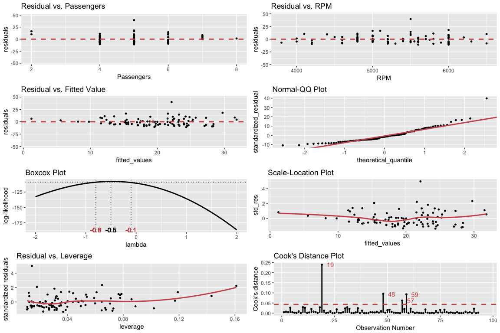
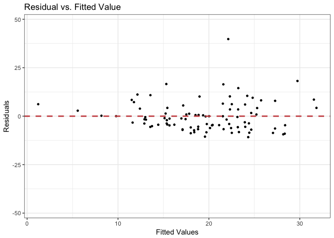
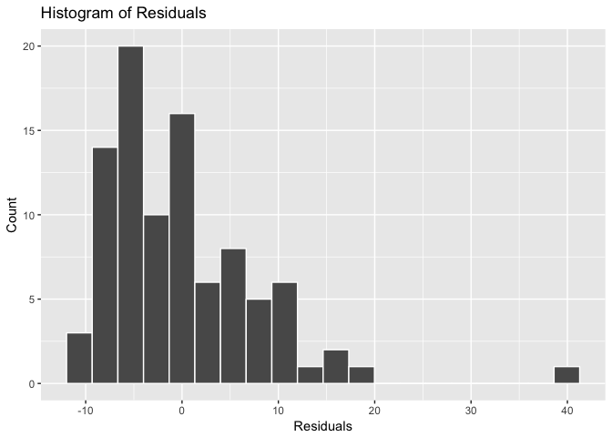
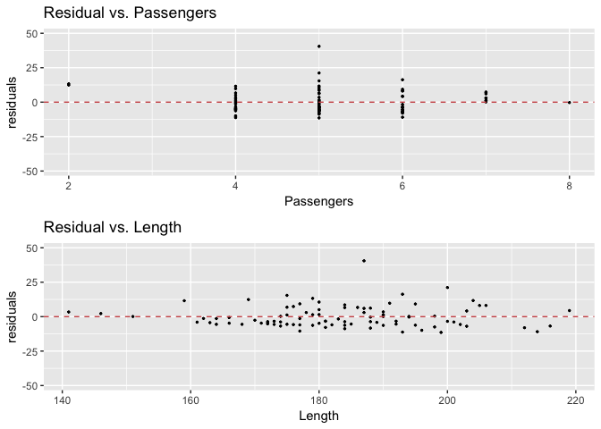
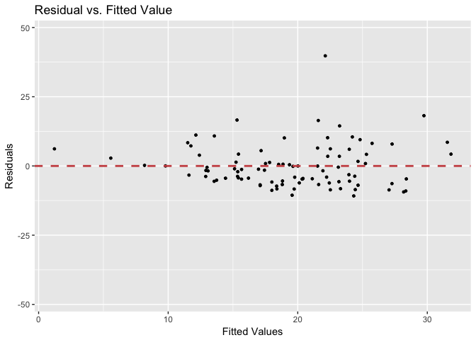
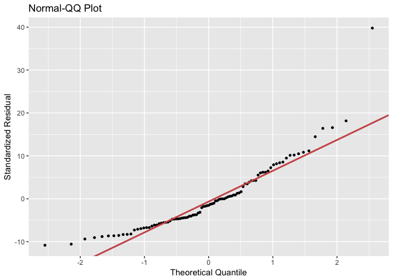
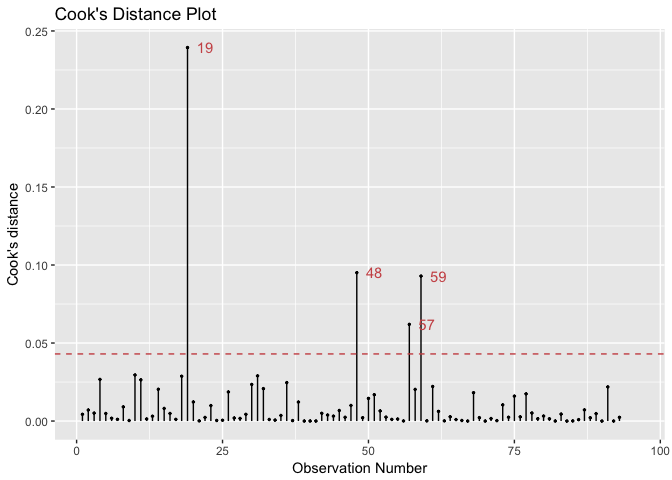
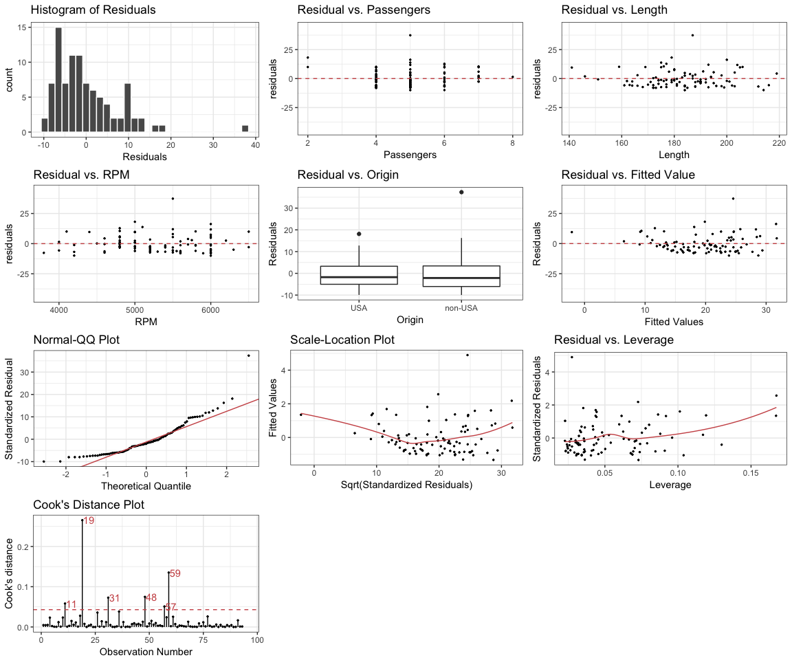

lindia
======

lindia is an extention to **ggplot2** to provide streamlined plotting features of linear diagnostic plots (including `lm()` and `glm()`). The following demonstrates basic plotting features of `lindia`. All functions in `lindia` takes in an lm object and return linear diagnostic plots in types of `ggplot`. The following code demonstrates how you can create a simple linear model from `Cars93` dataset, then use a call to `lindia::gg_diagnose` to visualize overall features of the distribution.

``` r
# create linear model
cars_lm <- lm(Price ~ Passengers + Length + RPM, data = Cars93)

# visualize diagnostic plots with a call to lindia
gg_diagnose(cars_lm)
```


Installation
============

-   From Github: `devtools::install_github("yeukyul/lindia")`

Overview
========

Followed are functions implemented in `lindia`:

-   [`gg_reshist()`](#gg_reshist): plotting the histogram of distribution of residuals
-   [`gg_resfitted()`](#gg_resfitted): residual plot of residuals by fitted value
-   [`gg_resX()`](#%20gg_resX): a list of residual plots of all predictors by fitted value (continuous variables only for now. Categorical and interaction terms are developing.)
-   [`gg_qqplot()`](#%20gg_qqplot): Normaility quantile-quantile plot (QQPlot) with qqline overlayed on top
-   [`gg_boxcox()`](#%20gg_boxcox): boxcox graph with optimal transformation labeled on graph
-   [`gg_scalelocation()`](#%20gg_scalelocation): scale-location plot (also called spread-location plot).
-   [`gg_resleverage()`](#%20gg_resleverage): residual vs. leverage plot. (cook distance indicators not implemented for now)
-   [`gg_diagnose()`](#%20gg_diagnose): all diagnostic plots being layed out on a grid (not functional yet).
-   [`gg_cooksd()`](#gg_cooksd): cook's distance plot with potential outliars labeled on top

`gg_resX()` and `gg_diagnose()` would return multiple plots after a call to the function. By default, they would return one aggregate plot of all diagnostic plots as one arranged grid. If user needs more flexibility in determining graphical elements and inclusion/exclustion of certain plots, set `plotAll` parameter in the function call to `FALSE`. It will return a list of all plots, which user can manipulate.

An example would as be followed:

``` r
plots <- gg_diagnose(cars_lm, plotAll = FALSE)
names(plots)
#  [1] "residual_hist"    "Passengers"       "Length"          
#  [4] "RPM"              "res_fitted"       "gg_qqplot"       
#  [7] "gg_boxcox"        "gg_scalelocation" "gg_resleverage"
exclude_plots <- plots[-c(1, 3) ]    #exclude certain diagnostics plots
include_plots <- plots[c(1, 3)]      # include certain diagnostics plots
```

In addition, `lindia` provides a `plot_all()` feature that allows users pass in a list of plots and output as a formatted grid of plots using `grid.arrange()` in `gridExtra`.

``` r
plot_all(exclude_plots)
```



All graphical styles returned by lindia graphing function can be overwritten by a call to `ggplot::theme()` (except `gg_resX()` and `gg_diagnose()`, which would return a list rather than a single ggplot object).

``` r
gg_resfitted(cars_lm) + theme_bw()
```


Functions in Lindia
===================

The following gives a brief demonstration of how to use the functions provided in `lindia`.

gg\_reshist
===========

Plots distribution of residuals in histograms. Number of bins picked by default.

``` r
gg_reshist(cars_lm)
```



Can also specify number of bins using `bins` argument:

``` r
gg_reshist(cars_lm, bins = 20)
```


gg\_resX
========

Plots residual plots of all predictors vs. residuals and return all plots as one plot that is arranged by package `gridExtra`. If a variable is continuous, it would be plotted as scatterplot. If a given variable is category is categorical, lindia would plot boxplot for that variable.

``` r
cars_lm_2 <- lm(Price ~ Passengers + Length + RPM + Origin, data = Cars93)
gg_resX(cars_lm)
```



`lindia` can also handle linear models with interaction terms.

``` r
cars_lm_inter <- lm(Price ~ Passengers * Length, data = Cars93)
gg_resX(cars_lm_inter)
```


gg\_resfitted
=============

Plots residual against fitted value.

``` r
gg_resfitted(cars_lm)
```



gg\_qqplot
==========

Plots quantile quantile plot of a linear model, with qqline overlayed on top.

``` r
gg_qqplot(cars_lm)
```



gg\_boxocx
==========

Plots boxcox graph of given lm object, with labels showing optimal transforming power of response variable using box-cox transformation. Can hide labels on graph by setting `showlambda` to `FALSE`.

``` r
gg_boxcox(cars_lm)
```



gg\_scalelocation
=================

Plots scale location graph of linear model.

``` r
gg_scalelocation(cars_lm)
```


gg\_resleverage
===============

Plots residual vs. leverage of data points to detect outliers using cook's distance.

``` r
gg_resleverage(cars_lm)
```


gg\_cooksd
==========

Plots residual vs. leverage of data points to detect outliers using cook's distance.

``` r
gg_cooksd(cars_lm)
```


gg\_diagnose
============

An aggregate plot of all diagnostics plots, layed out on one panel as demonstrated in the beginning of this read me document. User can set `theme` parameter to a specific theme type in order to apply to all plots in the panel.

``` r
gg_diagnose(cars_lm_2, theme = theme_bw())
```



If user set `plotAll` parameter to false, `gg_diagnose` would return a list of ggplot objects which user can manipulate. `lindia` also provides a handy trick that allows user to scale all point sizes and linewidth at once, using the parameter `scale.factor`.

``` r
gg_diagnose(cars_lm_2, scale.factor = 2)
```



Package Dependency
==================

Lindia is built on top of the following few packages:

-   `ggplot2`: ver 2.1.0

-   `gridExtra`: ver 2.1.1
