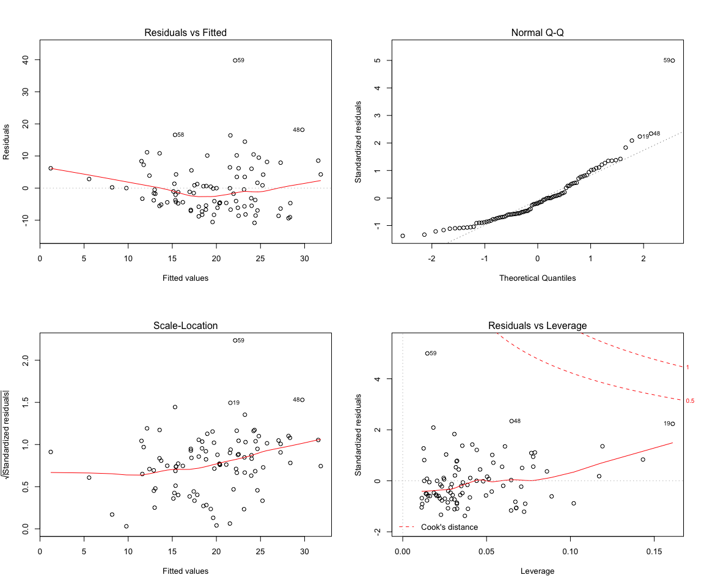

lindia
======

lindia is an extention to ***ggplot2*** to allow easy plotting of linear diagnostic plots. The following demonstrates basic plotting features of `lindia`. All functions in `lindia` takes in lm object and return linear diagnostic plots in types of `ggplot`.

``` r
library(MASS)
library(ggplot2)
library(lindia)
data(Cars93)
cars_lm <- lm(Rev.per.mile ~ Passengers + Length + RPM, data = Cars93)
gg_resfitted(cars_lm)
```


All themes in `lindia` plots can be overwritten by a call to `ggplot::theme()`.

``` r
gg_reshist(cars_lm) + theme_bw()
```



Overview
========

Followed are functions implemented in `lindia`:

-   `gg_reshist()`: plotting the histogram of distribution of residuals
-   `gg_resfitted()`: residual plot of residuals by fitted value
-   `gg_resX()`: a list of residual plots of all predictors by fitted value (continuous variables only for now. Categorical and interaction terms s are developing.)
-   `gg_qqplot()`: Normaility quantile-quantile plot (QQPlot) with qqline overlayed on top
-   `gg_boxcox()`: boxcox graph with optimal transformation labeled on graph
-   `gg_scalelocation()`: scale-location plot (also called spread-location plot).
-   `gg_resleverage()`: residual vs. leverage plot. (cook distance indicators not implemented for now)
-   `gg_diagnose()`: all diagnostic plots being layed out on a grid.

Functions that maybe implemented: + `diagnames()`: returns a vector of names of all diagnostic plots available for a given lm object

Functions in Lindia
===================

### gg\_reshist

Plot distribution of residuals in histograms. Number of bins picked by default.

``` r
gg_reshist(cars_lm)
```


Can also specify number of bins using `bins` argument:

``` r
gg_reshist(cars_lm, bins = 20)
```


### gg\_resfitted

Plots residual against fitted value.

``` r
gg_resfitted(cars_lm)
```


### gg\_boxocx

Plots boxcox graph of given lm object, with labels showing optimal transforming power. Can hide labels by setting `showlambda` to `FALSE`.

``` r
gg_boxcox(cars_lm)
```


How to Install
==============

-   From Github: `devtools::install_github("yeukyul/lindia")`
